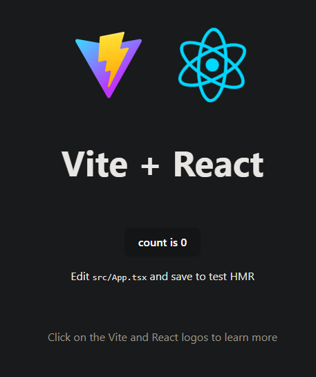
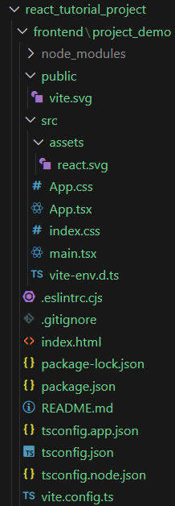
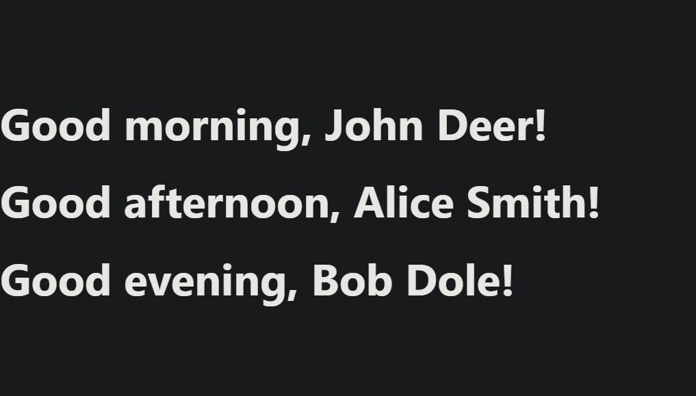

# React Tutorial (w/ Vite.js and Typescript)

Welcome to the React Tutorial! This guide will walk you through the basics of React, including its history, purpose, and core concepts. By the end of this tutorial, you'll be able to create a basic React application with functional components, manage state and effects, use conditionals, implement routing, and use context for state management.

## Table of Contents

1. [History and Purpose](#history-and-purpose)
2. [Getting Started](#getting-started)
3. [JSX and TSX](#jsx-and-tsx)
4. [Components](#components)
5. [State and Effect Hooks](#state-and-effect-hooks)
6. [Conditionals](#conditionals)
7. [Router](#router)
8. [Context](#context)

## History and Purpose

React is a JavaScript library for building user interfaces, developed by Facebook in 2013. It allows developers to create large web applications that can update and render efficiently in response to data changes. React's main goal is to make the process of building UIs easier and more efficient by promoting component-based architecture and declarative programming.

## Getting Started

To get started with React, you'll need to have Node.js and npm (Node Package Manager) installed on your machine. You can download them from [nodejs.org](https://nodejs.org/).

Once you have Node.js and npm installed, you can create a new React application using Create React App, a tool that sets up a new React project with a sensible default configuration.

```bash
mkdir frontend && cd frontend
npm create vite@latest project_demo -- --template react-ts
cd project_demo
npm install
npm run dev # edit package.json, "scripts.dev": "vite --open" (auto open browser on run)
```

*default react app view*  


*default project directory set-up*  


## JSX and TSX

JSX (JavaScript XML) is a syntax extension for JavaScript that allows you to write HTML directly within JavaScript. It provides a way to structure component rendering using syntax that is familiar to web developers. JSX is not required to use React, but it makes the code easier to understand and more concise.

TSX (Typescript XML) is a superset of JavaScript that adds static types, providing better tooling and error checking during development. It allows you to leverage TypeScript's features while writing your React components, making your code more robust and easier to maintain, especially in larger applications where managing props and state can become complex.

*JSX example*
``` jsx
function Welcome() {
  return <h1>Hello, world!</h1>;
}
```

*TSX equivalent*
``` tsx
const Welcome: React.FC = () => {
  return <h1>Hello, world!</h1>;
};
```

### Embedding Expressions
You can embed a JavaScript expression in JSX by wrapping it in curly braces {}. This allows you to dynamically display values and use JavaScript logic within your markup.

*embedding example*
``` jsx
const name: string = 'John Deer'

const Welcome: React.FC = ({ name }) => {
  return <h1>Hello, {name}!</h1>;
};
```

## Components
React applications are built using components, which are reusable pieces of UI. There are two types of components: functional and class-based. This tutorial will focus on functional components.  
*components tend to live in `src/components`*

### Functional Components
Functional components are JavaScript functions that return JSX.

*TSX component*
``` tsx
// src/components/Greetings.tsx (make this file)
import React from 'react';

interface GreetingProps {
    name: string
}

const Greeting_1: React.FC<GreetingProps> = ({ name }) => {
  return <h1>Good morning, {name}!</h1>;
};
export default Greeting_1;

export const Greeting_2: React.FC<GreetingProps> = ({ name }) => {
  return <h1>Good afternoon, {name}!</h1>;
};

export const Greeting_3: React.FC<GreetingProps> = ({ name }) => {
  return <h1>Good evening, {name}!</h1>;
};

// not exported (cannot be used outside of this file)
const Greeting_4: React.FC<GreetingProps> = ({ name }) => {
  return <h1>Good night, {name}!</h1>;
};
```

### Using Components
Components can be used within the hierarchy of your app and components to structure your application. This allows for code reuse and better organization.

*example usage*
``` tsx
// src/App.tsx (update this file)
import React from 'react'
import Greeting_1, { Greeting_2, Greeting_3 } from './components/Greetings';

const people = [
    "John Deer",
    "Alice Smith",
    "Bob Dole",
    "Not Sure",
];

const App: React.FC = () => {
    return (<>
        <Greeting_1 name={people[0]} />
        <Greeting_2 name={people[1]} />
        <Greeting_3 name={people[2]} />

        {/* will cause error because Greeting_4 is not imported, and currently unable to be imported */}
        {/* <Greeting_4 name={people[3]} /> */}
    </>)
}

export default App;
```

*updated app using new components*  
