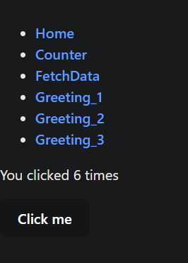

# React Tutorial (w/ Vite.js and Typescript)

Welcome to the React Tutorial! This guide will walk you through the basics of React, including its history, purpose, and core concepts. By the end of this tutorial, you'll be able to create a basic React application with functional components, manage state and effects, use conditionals, implement routing, and use context for state management.

## Table of Contents

1. [History and Purpose](#history-and-purpose)
2. [Getting Started](#getting-started)
3. [JSX and TSX](#jsx-and-tsx)
4. [Components](#components)
5. [useState Hook](#state-hook)
6. [useEffect Hook and Conditional Rendering](#effect-hook-conditional-rendering)
7. [Router](#router)
8. [Context](#context)

## History and Purpose

React is a JavaScript library for building user interfaces, developed by Facebook in 2013. It allows developers to create large web applications that can update and render efficiently in response to data changes. React's main goal is to make the process of building UIs easier and more efficient by promoting component-based architecture and declarative programming.

## Getting Started

To get started with React, you'll need to have Node.js and npm (Node Package Manager) installed on your machine. You can download them from [nodejs.org](https://nodejs.org/).

Once you have Node.js and npm installed, you can create a new React application using Create React App, a tool that sets up a new React project with a sensible default configuration.

```bash
mkdir frontend && cd frontend
npm create vite@latest project_demo -- --template react-ts
cd project_demo
npm install
npm run dev # edit package.json, "scripts.dev": "vite --open" (auto open browser on run)
```

*default react app view*  


*default project directory set-up*  


## JSX and TSX

JSX (JavaScript XML) is a syntax extension for JavaScript that allows you to write HTML directly within JavaScript. It provides a way to structure component rendering using syntax that is familiar to web developers. JSX is not required to use React, but it makes the code easier to understand and more concise.

TSX (Typescript XML) is a superset of JavaScript that adds static types, providing better tooling and error checking during development. It allows you to leverage TypeScript's features while writing your React components, making your code more robust and easier to maintain, especially in larger applications where managing props and state can become complex.

*JSX example*
``` jsx
function Welcome() {
  return <h1>Hello, world!</h1>;
}
```

*TSX equivalent*
``` tsx
const Welcome: React.FC = () => {
  return <h1>Hello, world!</h1>;
};
```

### Embedding Expressions
You can embed a JavaScript expression in JSX by wrapping it in curly braces {}. This allows you to dynamically display values and use JavaScript logic within your markup.

``` jsx
const name: string = 'John Deer'

const Welcome: React.FC = ({ name }) => {
  return <h1>Hello, {name}!</h1>;
};
```

## Components
React applications are built using components, which are reusable pieces of UI. There are two types of components: functional and class-based. This tutorial will focus on functional components.  
*components tend to live in `src/components`*

### Functional Components
Functional components are JavaScript functions that return JSX.

``` tsx
// src/components/Greetings.tsx (make this file)
import React from 'react';

interface GreetingProps {
  name: string
}

const Greeting_1: React.FC<GreetingProps> = ({ name }) => {
  return <h1>Good morning, {name}!</h1>;
};
export default Greeting_1;

export const Greeting_2: React.FC<GreetingProps> = ({ name }) => {
  return <h1>Good afternoon, {name}!</h1>;
};

export const Greeting_3: React.FC<GreetingProps> = ({ name }) => {
  return <h1>Good evening, {name}!</h1>;
};

// not exported (cannot be used outside of this file)
const Greeting_4: React.FC<GreetingProps> = ({ name }) => {
  return <h1>Good night, {name}!</h1>;
};
```

### Using Components
Components can be used within the hierarchy of your app and components to structure your application. This allows for code reuse and better organization.

``` tsx
// src/App.tsx (update this file)
import React from 'react'
import Greeting_1, { Greeting_2, Greeting_3 } from './components/Greetings';

const people = [
    "John Deer",
    "Alice Smith",
    "Bob Dole",
    "Not Sure",
];

const App: React.FC = () => {
    return (<>
        <Greeting_1 name={people[0]} />
        <Greeting_2 name={people[1]} />
        <Greeting_3 name={people[2]} />

        {/* will cause error because Greeting_4 is not imported, and currently unable to be imported */}
        {/* <Greeting_4 name={people[3]} /> */}
    </>)
}

export default App;
```

*updated app using new components*  


## useState Hook
The useState hook allows you to add state management to functional components.

``` tsx
// src/components/Counter.tsx (make this file)
import React, { useState } from 'react';

const Counter: React.FC = () => {
    const [count, setCount] = useState(0);

    const IncreaseCount = () => {
        setCount(count + 1)
    }

    return (<>
        <p>You clicked {count} times</p>
        <button
            onClick={IncreaseCount}
            >Click me
        </button>
    </>);
}

export default Counter;
```

``` jsx
// src/App.tsx (update this file)
import React from 'react'

const people = [
    "John Deer",
    "Alice Smith",
    "Bob Dole",
    "Not Sure",
];

const App: React.FC = () => {
    return (<>
        <Greeting_1 name={people[0]} />
        <Greeting_2 name={people[1]} />
        <Greeting_3 name={people[2]} />

        {/* will cause error because Greeting_4 is not imported, and currently unable to be imported */}
        {/* <Greeting_4 name={people[3]} /> */}
    </>)
}

export default App;
```

*updated app w/ useState*  


## useEffect Hook and Conditional Rendering
Effects are used to perform side effects in functional components, such as fetching data, directly updating the DOM, and timers. Conditional rendering in React allows you to render different elements or components based on a condition.

*(example api json data fetched from [https://reqres.in/api/users](https://reqres.in/api/users))*

``` tsx
// src/components/FetchData.tsx (make this file)
import React, { useState, useEffect } from 'react';

const fetchUsers = async () => {
    try {
        const response = await fetch('https://reqres.in/api/users');
        if (!response.ok) {
            throw new Error(`HTTP error! status: ${response.status}`);
        }
        const users = await response.json();
        console.log(users);
        return users;
    }   catch (error) {
        console.error('Error fetching users:', error);
    }
}

const FetchData: React.FC = () => {
    const [data, setData] = useState<any>(null);

    useEffect(() => {
        fetchUsers()
        .then(response => setData(response.data))
    }, [])

    useEffect(() => {
        if (data != null) {
            alert('fetched data')
        }
    }, [data])

    {/* conditional rendering example with if/else statement */}
    if (data == null) {
      return (<>
        <p>Fetching data...</p>
      </>)
    } else {
      return (<>
          {data.map((row: any, index: number) => {
            return <div key={index}>{row.email}</div>
          })}
      </>);
    }
}

export default FetchData;
```

``` tsx
// src/App.tsx (update this file)
import React from 'react'
import FetchData from './components/FetchData';

const App: React.FC = () => {
    return (<>
        <FetchData />
    </>)
}

export default App;
```

*updated app w/ useEffect and conditional rendering*  


*conditional rendering can also be achieved with the following syntax*
``` tsx
import React from 'react';

const render1 = false;
const render2 = true;

const MyComponent: React.FC = () => {
  return (<>
    {render1 && <h1>Not Rendered!</h1>} {/* this will not render as 'render1' is false*/}
    {render2 && <h1>Rendered!</h1>}
  </>)
}

export MyComponent
```

## Router
React Router is a library that enables navigation among views or components in a React application, allowing for client-side routing. First, install the additional package `react-router-dom`.

> npm install react-router-dom

``` tsx
// src/components/Views.tsx (make this file)
import React from "react";
import { Routes, Route, Link } from 'react-router-dom';

const Home: React.FC = () => <h1>Welcome home!</h1>
import Counter from "./Counter";
import FetchData from "./FetchData";
import Greeting_1, { Greeting_2, Greeting_3 } from "./Greetings";
const NotFound: React.FC = () => <h1>Page not found!</h1>

const Views: React.FC = () => <>
    <ul>
        <li><Link to='/'>Home</Link></li>
        <li><Link to='/Counter'>Counter</Link></li>
        <li><Link to='/FetchData'>FetchData</Link></li>
        <li><Link to='/Greeting_1'>Greeting_1</Link></li>
        <li><Link to='/Greeting_2'>Greeting_2</Link></li>
        <li><Link to='/Greeting_3'>Greeting_3</Link></li>
    </ul>
    <Routes>
        <Route path='/' element={<Home />}></Route>
        <Route path='/Counter' element={<Counter />}></Route>
        <Route path='/FetchData' element={<FetchData />}></Route>
        <Route path='/Greeting_1' element={<Greeting_1 name='John Deer'/>}></Route>
        <Route path='/Greeting_2' element={<Greeting_2 name='Alice Smith'/>}></Route>
        <Route path='/Greeting_3' element={<Greeting_3 name='Bob Dole'/>}></Route>
        <Route path='/*' element={<NotFound />}></Route>
    </Routes>
</>

export default Views
```

``` jsx
// src/App.tsx (update this file)
import React from 'react'
import { BrowserRouter as Router } from 'react-router-dom';
import Views from './components/Views';

const App: React.FC = () => {
    return (<>
        <Router>
            <Views />
        </Router>
    </>)
}

export default App;
```

*updated app w/ Router*  


## Context
The Context API is used to share state across the entire app (or part of it) without passing props down manually at every level.

``` tsx
// src/contexts/CounterProvider.tsx (make this file)
import React, { createContext, useContext, useState } from 'react'

const CounterContext = createContext<any>(0)
export const useCounterContext = () => useContext(CounterContext)

export const CounterProvider: React.FC<any> = ({ children }) => {
    const [count, setCount] = useState(0)
    const IncreaseCount = () => {
        setCount(prevCount => prevCount + 1)
    }

    return (<>
    <CounterContext.Provider value={{ count, IncreaseCount }}>
        { children }
    </CounterContext.Provider>
    </>)
}
```

``` tsx
// src/components/Counter.tsx (update this file)
import React from 'react';
import { useCounterContext } from '../contexts/CounterProvider';

const Counter: React.FC = () => {
    const { count, IncreaseCount } = useCounterContext()

    return (<>
        <p>You clicked {count} times</p>
        <button
            onClick={IncreaseCount}
            >Click me
        </button>
    </>);
}

export default Counter;
```

``` tsx
// src/App.tsx (update this file)
import React from 'react'
import { BrowserRouter as Router } from 'react-router-dom';
import Views from './components/Views';
import { CounterProvider } from './contexts/CounterProvider';

const App: React.FC = () => {
    return (<>
        <CounterProvider>
            <Router>
                <Views />
            </Router>
        </CounterProvider>
    </>)
}

export default App;
```

*now switching views will not reset the count because its state uses a Context Provider*  


## Conclusion
This completes the React tutorial along with examples of how to use functional components, state, effects, conditional rendering, router, and context in React with TypeScript.
